# map to explorable world

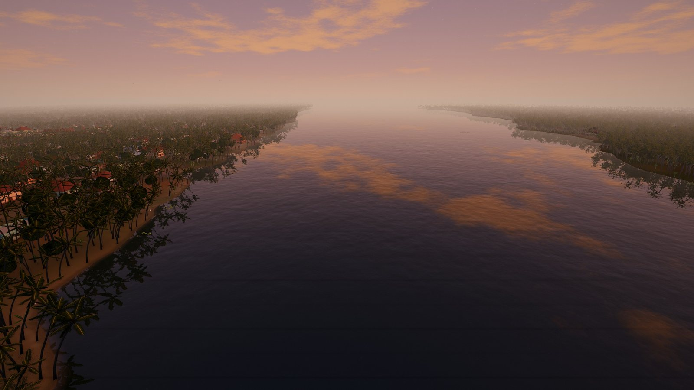

Turn a real place into a world you can walk through in a browser, built only from open data: OpenStreetMap,
open elevation tiles, Sentinel-2 satellite imagery, and ESA WorldCover. A Python pipeline packs a place into a few
megabytes. A three.js runtime grows the buildings, trees, water, terrain, and sky from that package when the page
loads, and holds 60 frames per second on an integrated laptop GPU.

This is the engine behind two earlier worlds, a backwater village in Kerala and a hilltop campus in Madhya Pradesh,
rebuilt as a general tool that works for any place the datasets cover. [How the engine works](docs/ENGINE.md) tells
the story of each technique, with short excerpts from the code where it started.

## Worlds built with this engine

### Kumbalangi

An island village in the Kochi backwaters: 3,440 houses from OpenStreetMap footprints, 94,000 trees placed from
Sentinel-2's vegetation index, boatmen and Chinese fishing nets, monsoon rain, and a sound score synthesized live. It
draws its first frame about two seconds after the page opens, from a 2.6 MB package. The project itself isn't public;
the excerpts in [How the engine works](docs/ENGINE.md) are the only code from it here.

| | |
|---|---|
| 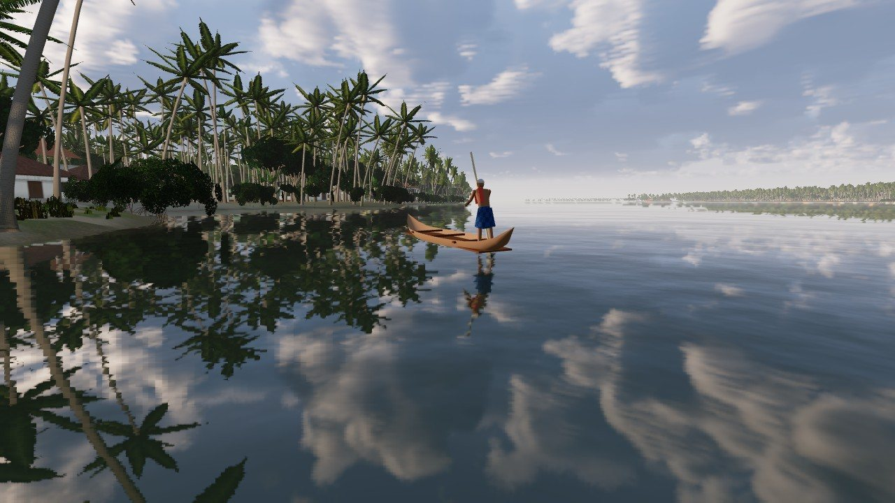 | 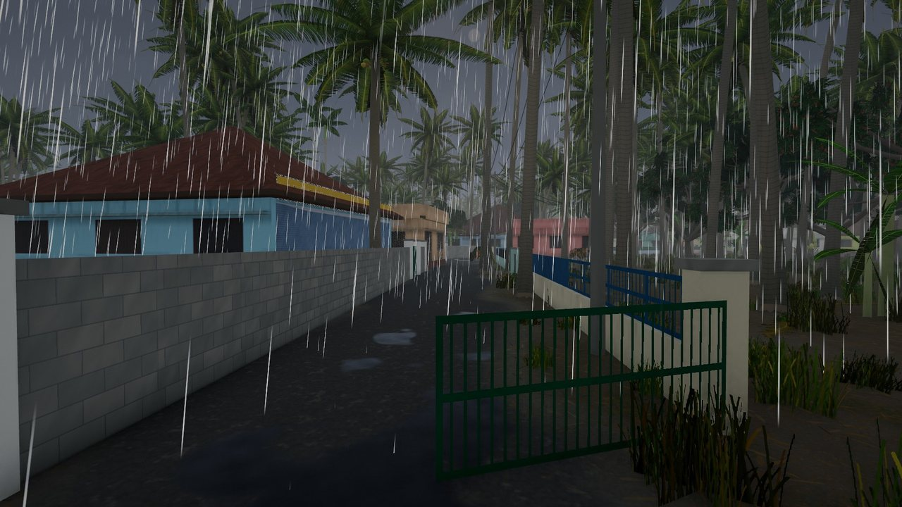 |
| 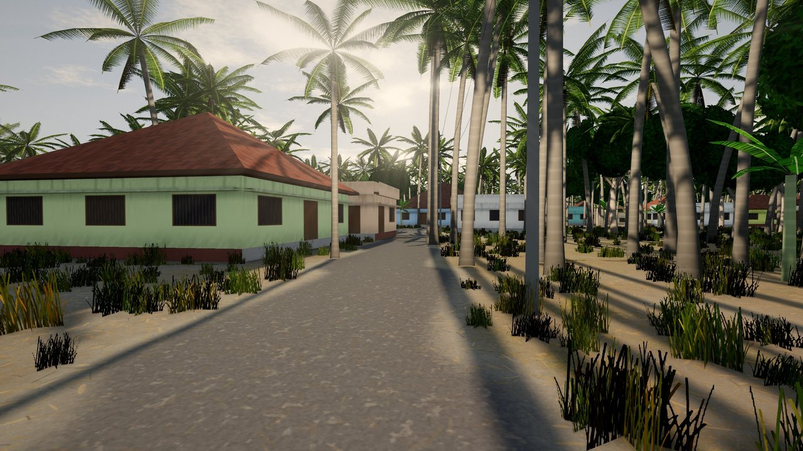 | 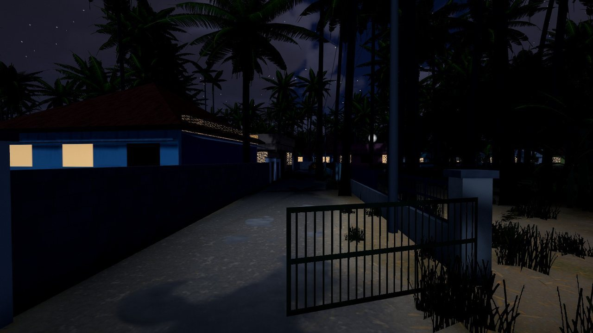 |
| 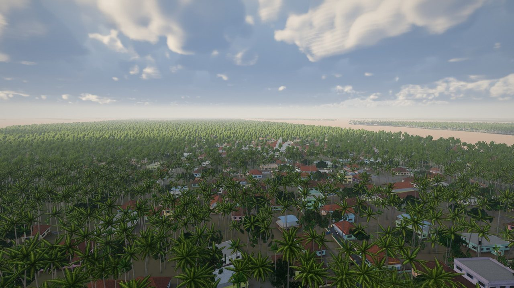 | 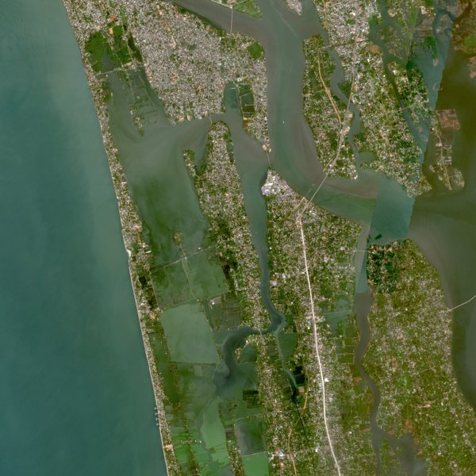 |

### IIM Indore campus

The first world, and the one that set the pipeline's pattern: OpenStreetMap footprints and roads, SRTM terrain with
building bumps removed, and about 9,800 trees placed from Sentinel-2 and WorldCover. Its landmarks were modeled in
Blender from photographs, and four rounds of blind photo-matching critique shaped its look. It's an unofficial fan
recreation, not affiliated with IIM Indore.

| | |
|---|---|
| 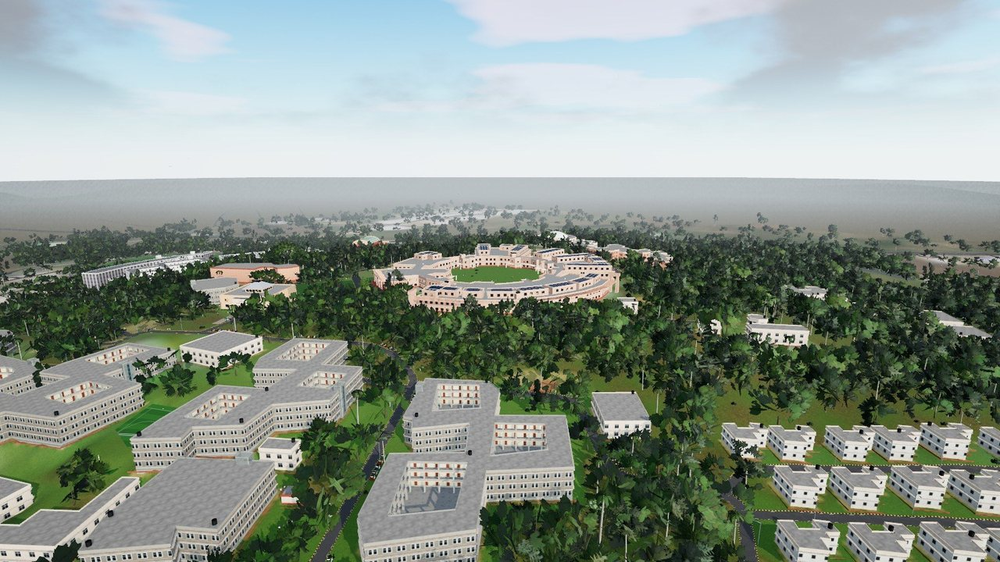 | 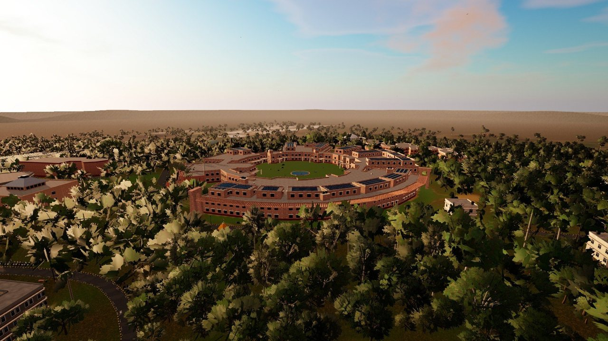 |
| 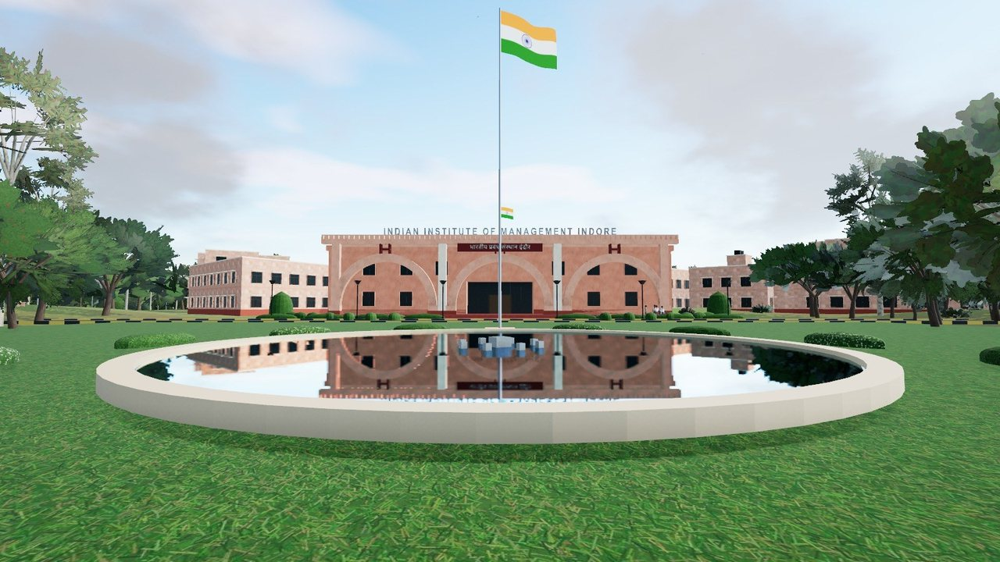 |  |

### Example worlds in this repository

The two worlds in `web/public/worlds/` were built with the open pipeline in this repository, with no hand editing.

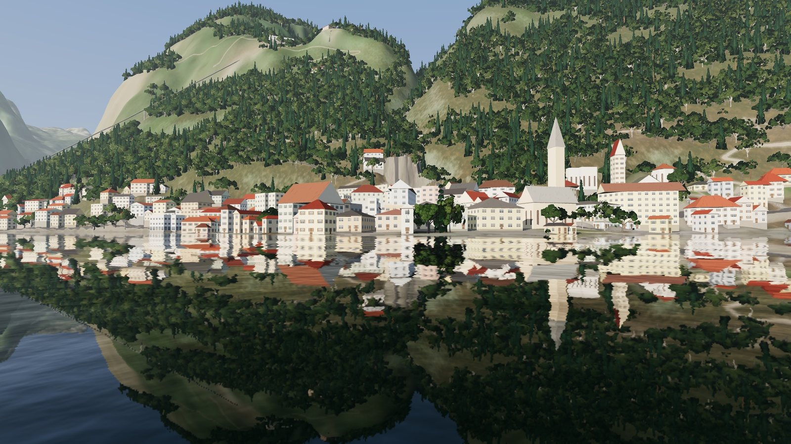

| | |
|---|---|
| 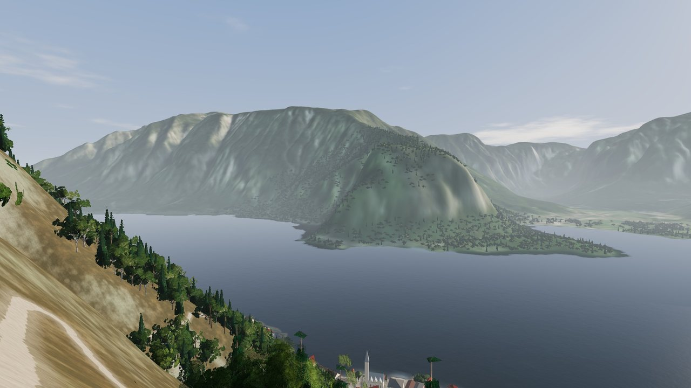 | 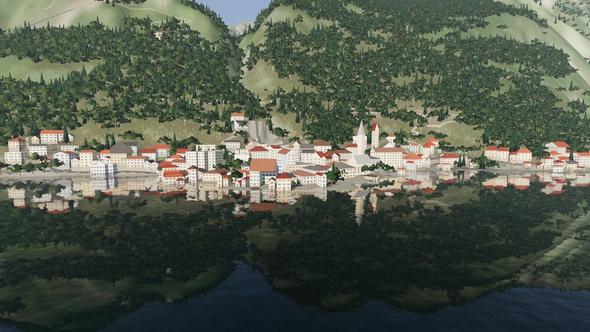 |
| 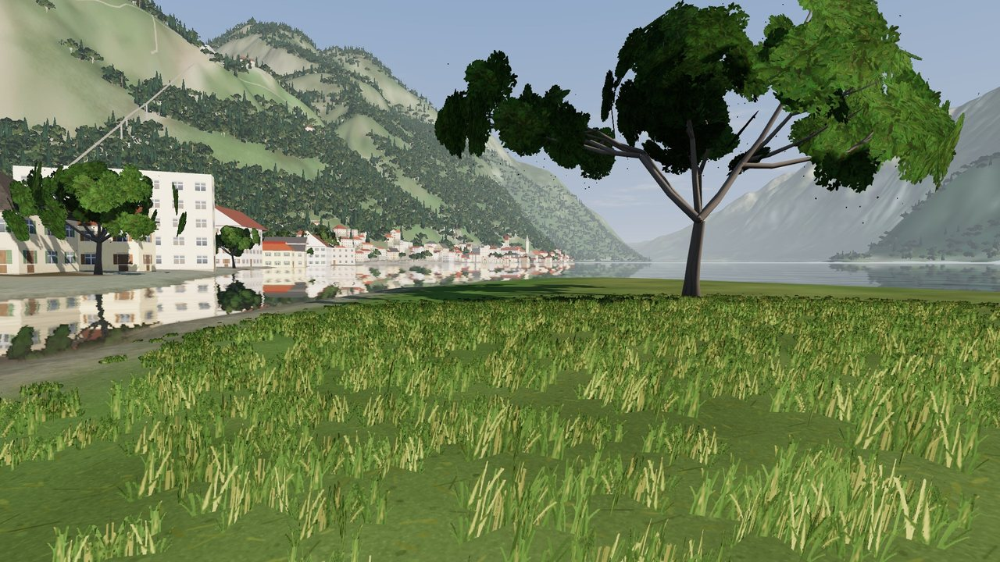 | 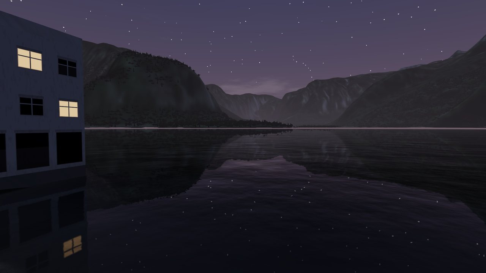 |
| 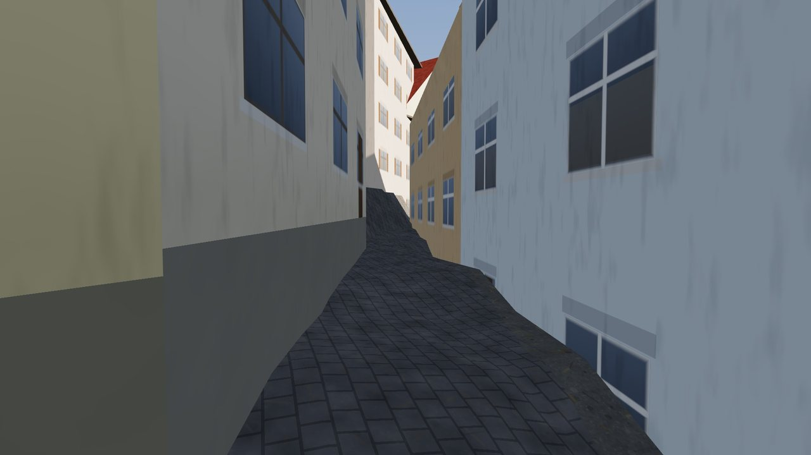 | 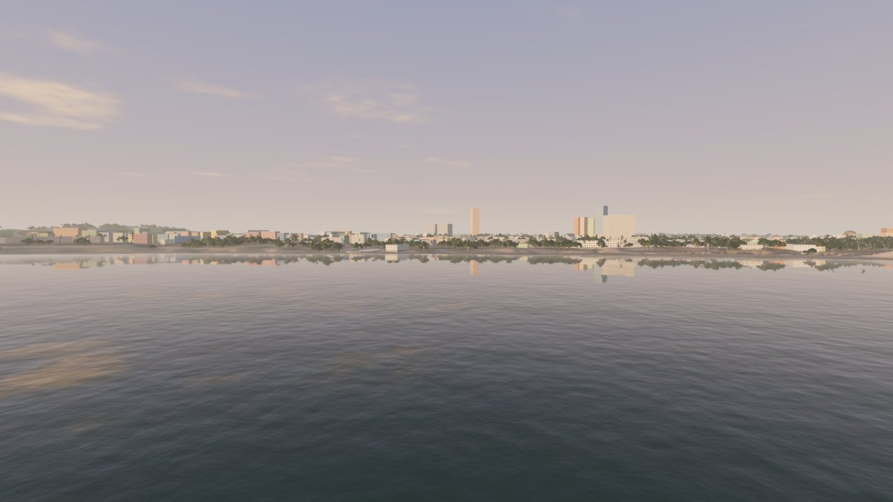 |

- **Hallstatt**, Austria: a 2 km walkable core and an 18 km context ring of Alpine relief, 760 buildings, and about
  192,000 trees. The package is 3.2 MB.
- **Marine Drive**, Mumbai: Back Bay, Chowpatty, and Malabar Hill in a 2.6 km core, 1,165 buildings, and palms along
  the streets. The package is 1.6 MB. OpenStreetMap maps only part of South Mumbai's buildings, and the world shows
  it: there's more open ground than the real city has.

## Try it

You need [Node.js](https://nodejs.org/) 20 or later and a browser with WebGL 2: a recent Chrome, Edge, Firefox, or
Safari.

1. Install the dependencies:

   ```bash
   cd web
   npm install
   ```

1. Start the development server:

   ```bash
   npm run dev
   ```

1. Open `http://127.0.0.1:5194`, click **Enter**, and then click the scene to look around.

To open another world, add `?world=` and its folder name, for example `http://127.0.0.1:5194/?world=marine-drive`.

To serve the production build, run `npm run build` and then `npm run preview`, which listens on port 5195. The build
uses relative paths, so you can host `web/dist` from any folder of any static file server.

## Build a world of your own

You need Python 3.10 or later. The pipeline doesn't need an account or an API key for any of its data.

1. Install the Python packages:

   ```bash
   pip install -r requirements.txt
   ```

1. Create a world configuration from a place name. The pipeline asks the OpenStreetMap geocoder for the place and
   writes `worlds/PLACE.json`:

   ```bash
   python -m pipeline new "Hallstatt, Austria"
   ```

   You can also write the file yourself. Only `name` and `center` are required:

   ```json
   {
     "name": "Hallstatt",
     "center": {"lat": 47.5605, "lon": 13.6445},
     "half": 1000,
     "far": 9000,
     "timeZone": "Europe/Vienna",
     "sentinel2": {"months": [6, 7, 8, 9]}
   }
   ```

1. Fetch the data and build the package. Replace `PLACE` with the name of your configuration file:

   ```bash
   python -m pipeline worlds/PLACE.json
   ```

   The first run downloads everything into `cache/`, which takes from two to fifteen minutes, mostly waiting for the
   public OpenStreetMap servers. Later runs reuse the cache and take about 30 seconds.

1. Open `http://127.0.0.1:5194/?world=PLACE`.

To check every layer of a package before you open it, render a contact sheet:

```bash
python tools/inspect_world.py web/public/worlds/PLACE
```

### Configuration options

| Option | Default | Meaning |
|---|---|---|
| `half` | `1000` | Half the side of the walkable core, in meters, up to 3000 |
| `far` | `6000` | Half the side of the context ring, in meters; `0` turns it off |
| `timeZone` | none | IANA time zone, such as `Asia/Kolkata`, for the clock and the sun, with daylight-saving time |
| `tz` | from longitude | Fixed offset from UTC in hours, used when `timeZone` is absent |
| `spawn` | busiest street | `{"lat": …, "lon": …}` to start at |
| `sentinel2.months` | all | Months to take scenes from, for example `[5, 6, 7, 8, 9]` for leaf-on, snow-free imagery |
| `sentinel2.maxCloud` | `40` | Tile-level cloud filter for the catalog search, in percent |
| `terrain.debump` | `auto` | Remove building and canopy bumps from surface-model elevation: `auto`, `true`, or `false` |
| `buildings.palette` | `auto` | Wall and roof colors: `europe`, `south-asia`, `east-asia`, `arid`, `americas`, or `tropical` |
| `buildings.pitched` | `auto` | Share of untagged houses with pitched roofs, from 0 to 1 |
| `vegetation.biome` | from latitude | `tropical`, `subtropical`, `arid`, `temperate`, or `boreal` |
| `vegetation.density` | `1.0` | Multiplies the tree placement probability |

The full list, with comments, is in `pipeline/config.py`.

A world looks only as complete as OpenStreetMap is for that place. Before you build, open the area on
[openstreetmap.org](https://www.openstreetmap.org/) and check that its buildings are mapped.

## Controls

| Input | Action |
|---|---|
| Mouse and W, A, S, D | Look around and walk. Shift runs and Space jumps. You collide with buildings and trunks, and you can wade into shallow water. |
| F | Free flight. Space and Q climb and sink, and the mouse wheel sets the speed. |
| G | Drone tour through the place's landmarks. Any movement key takes over. |
| 1 to 9 | Viewpoints chosen from the data: the center, named places, viewpoints, the waterfront, and an overview. |
| T | Next time of day. |
| `[` and `]` | Move the clock 15 minutes. |
| P | Time-lapse. |
| M | Map: corner, large, or off. In the large map, click a spot to go there. |
| H | Help. |
| U | Hide the interface. |

On a touch screen, drag one finger to look around, and hold a second finger down to move forward.

| URL option | Effect |
|---|---|
| `?world=NAME` | Open the world in `web/public/worlds/NAME/`. |
| `?t=HOUR` | Start at that local hour, for example `?t=17.5`. |
| `?q=low`, `?q=med`, `?q=high` | Quality preset. The default comes from the GPU that WebGL reports. |
| `?pos=x,z,y,yaw,pitch` | Open at that camera pose. Add `&mode=walk` to start on foot. |
| `?fps` | Show the frame rate, render scale, draw calls, and triangles. |
| `?fixed` | Hold the render scale instead of adapting it. |
| `?nointro` | Skip the intro sheet. |
| `?debug` | Turn on three.js shader error checks. |

## How it works

The pipeline turns four open datasets into a world package of ten files. The runtime reads the package and
generates the world from it in the browser.

```text
OpenStreetMap ──┐                                               ┌─ terrain, water, buildings   (two Web Workers)
Terrain Tiles ──┤                                               │
Sentinel-2 ─────┼─ python -m pipeline ─▶ world package (1–4 MB) ┼─ trees and impostors
WorldCover ─────┘                                               └─ sky, sun, fog, shadows      (main thread)
```

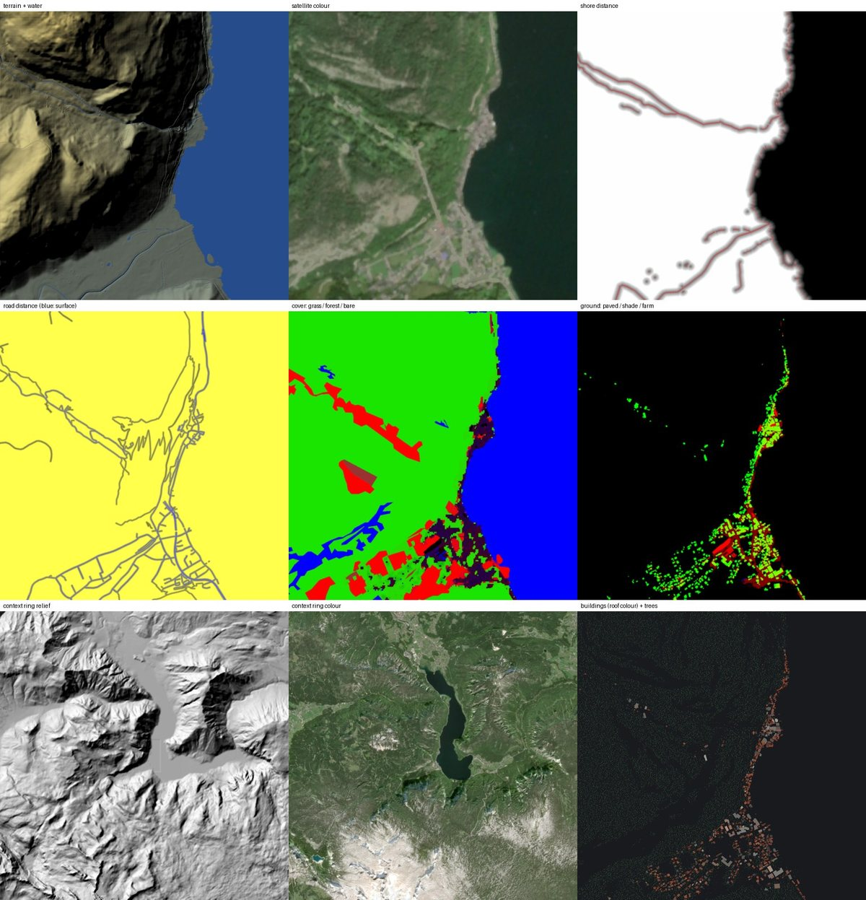

- **Pipeline** (`pipeline/`): fetches and caches the data, removes building bumps from surface-model elevation,
  finds water and sets each water body's level, carves lake and river beds, turns roads into a distance field,
  estimates building heights and roofs, plants trees, and packs everything into quantized arrays and lossless WebP
  images. For each layer's sources and method, see [Data sources and how each layer is made](docs/DATA.md).
- **World package** (`web/public/worlds/NAME/`): a JSON header, one binary file, and eight WebP images. To write your
  own pipeline or renderer for it, see [World package format](docs/WORLD_FORMAT.md).
- **Runtime** (`web/`): about 2,800 lines of JavaScript on three.js. Everything visual that isn't data is generated
  in code: tree species, foliage textures, facades, ground textures, water ripples, and clouds. For the techniques,
  see [How the engine works](docs/ENGINE.md).

### Repository layout

| Path | Contents |
|---|---|
| `pipeline/fetch/` | Downloaders for OpenStreetMap (Overpass), Terrain Tiles, Sentinel-2 (Earth Search), and WorldCover |
| `pipeline/build/` | One module per layer: `terrain`, `water`, `roads`, `ground`, `buildings`, `trees`, `far`, `places`, and `pack` |
| `worlds/` | World configurations |
| `web/src/` | The runtime: `main.js` (loading, frame loop, governor), `world.js` (package loader), `terrain`, `water`, `buildings`, `far`, `grass`, `atmosphere`, `terrainshadow`, `trees/`, `controls`, and `ui` |
| `web/src/build/` | Worker-side geometry builders for the terrain, water, and buildings |
| `web/public/worlds/` | Built world packages |
| `tools/` | `inspect_world.py` renders a package's layers; `capture_server.py` saves canvas captures |
| `docs/` | The engine, data, and format documentation |

## Performance

The runtime targets an integrated laptop GPU at 720p, which has 16.7 ms per frame at 60 Hz. The following table lists
GPU time per frame, measured with timer queries at 1280×720 on the `med` preset, on the integrated AMD Radeon
graphics of a 2020 Ryzen 4000-series laptop.

| View | Hallstatt | Marine Drive |
|---|---|---|
| Street level | 9.5 ms | 8.4 ms |
| Waterfront, with the water reflection | 11.3 ms | 6.7 ms |
| Overview from about 400 m | 13.8 ms | 11.1 ms |

The production build draws its first frame about 1.7 seconds after the page opens on the same laptop, with a warm
shader cache. When a view needs more than the budget, the resolution governor lowers the render scale slightly to hold
the refresh rate, and raises it again when there's headroom.

The techniques behind those numbers:

| Technique | What it does |
|---|---|
| Worker-built geometry | Two Web Workers build the terrain, water, and buildings, and hand them over as transferable typed arrays. |
| Error-bounded terrain | Every chunk gets the coarsest grid within a height tolerance, at three tolerances chosen by distance, with skirts and a full-resolution normal map. |
| Occluders first | Buildings draw before everything else, so the depth test rejects the terrain and trees behind them unshaded. In a village lane this cuts the frame time by about 40%. |
| Three tree levels | Full meshes up close, reduced meshes further out, and impostors from an atlas baked at startup, cross-faded with screen-door dither. |
| Per-pass tree lists | The main view, the reflection, and the shadow map each draw their own list of trees. |
| Reflections on demand | The water reflection renders at reduced resolution without shadows, and an occlusion query skips it when no water is on screen. |
| Two shadow scales | A camera-following, texel-snapped shadow map near you, and a heightfield ray-marched toward the sun for mountains and valleys. |
| Cheap distance | Impostors take their lighting per tree instead of per pixel, and the terrain hands over to the satellite color beyond 1 km. |
| Dynamic resolution | A vsync-aware governor trades render scale for a steady frame rate. |

To measure on your own machine, open the browser console and run `await window.__world.gpuProbe()`. It returns the
GPU milliseconds per frame, and the cost of each part of the scene from interleaved frames with that part on and off.

## Limitations

- Buildings exist only where OpenStreetMap maps them. Heights and roof shapes are estimated where tags are missing,
  and facades are generic patterns, not the real buildings. There are no interiors.
- Elevation in much of the world comes from 30 m SRTM, so road cuts, steps, and embankments are missing.
- A river's level is smoothed from its banks, and water has ripples but no waves or foam.
- The walkable core is at most 6 km across, and the context ring has relief, color, and trees, but no buildings.
- Trees are six generic species, chosen by biome and elevation. The pipeline places individual trees by canopy
  density, not by survey, except where OpenStreetMap maps them.
- Public Overpass servers share their capacity, so the first fetch of a world can wait several minutes.

## Credits and licenses

The code is available under the [MIT License](LICENSE).

World packages and screenshots of them carry the licenses of their sources:

- Map data © [OpenStreetMap](https://www.openstreetmap.org/copyright) contributors, available under the Open
  Database License. A world package is a derived database: if you distribute one, distribute it under the ODbL.
- Contains modified Copernicus Sentinel-2 data, accessed through Element 84 Earth Search.
- ESA WorldCover 2021 v200, available under CC BY 4.0.
- Elevation from Terrain Tiles on AWS (Mapzen and Tilezen), with the source attributions listed in
  [the Tilezen attribution notes](https://github.com/tilezen/joerd/blob/master/docs/attribution.md).

For what each world needs when you publish it, see [Attribution](docs/DATA.md#attribution).

Kumbalangi and the IIM Indore campus are unofficial fan projects, not affiliated with the village, the panchayat, any
film, or IIM Indore. The engine was built in collaboration with Claude, on [three.js](https://threejs.org/) and
[Vite](https://vite.dev/).
